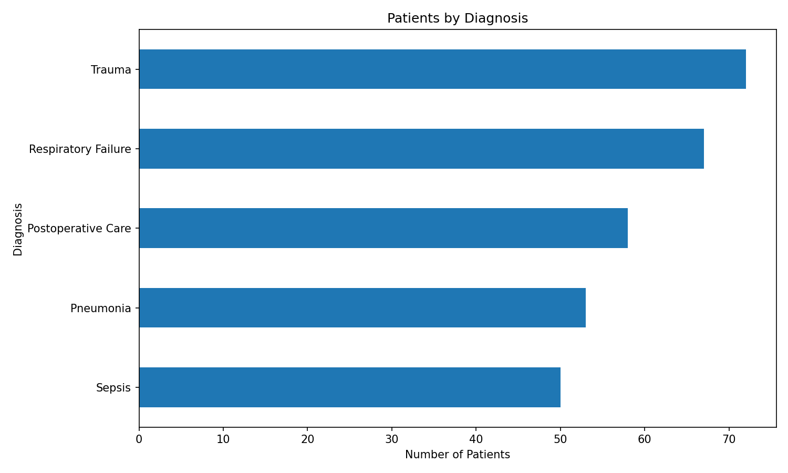
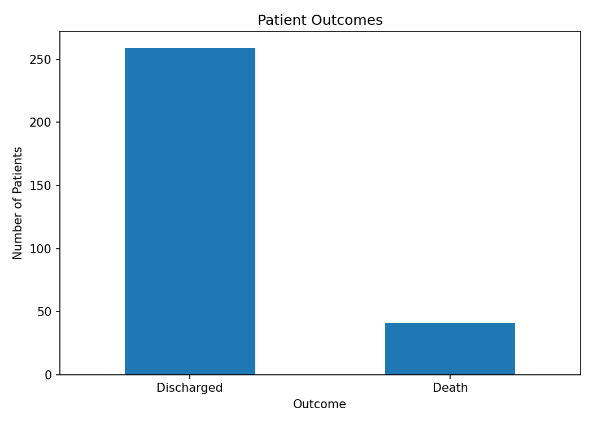
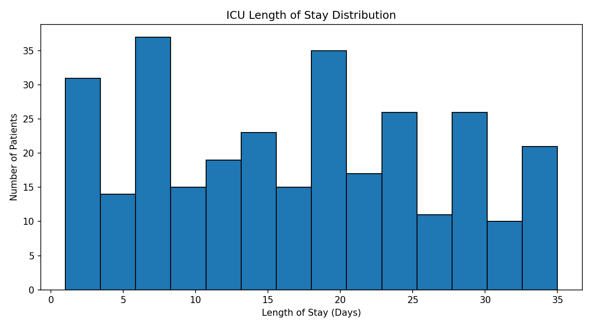

# ICU Data Analysis with Python

A portfolio project focused on analyzing synthetic intensive care unit data using Python, Pandas, and Matplotlib.

The project transforms raw healthcare data into meaningful indicators, automated reports, and visual insights.

## Project Overview

This analysis explores a synthetic dataset containing 300 ICU patient records.

The workflow includes:

- dataset validation;
- removal of duplicate and invalid records;
- KPI calculation;
- diagnosis-level aggregation;
- automated CSV report generation;
- chart creation;
- structured logging;
- error handling.

## Key Performance Indicators

| Indicator | Result |
|---|---:|
| Total patients | 300 |
| Average age | 58.2 years |
| Average length of stay | 16.9 days |
| Mortality rate | 13.7% |
| Mechanical ventilation rate | 45.0% |
| Readmission rate | 12.3% |

## Visual Results

### Patients by Diagnosis



### Patient Outcomes



### Length of Stay Distribution



## Tech Stack

- Python
- Pandas
- Matplotlib
- Git
- GitHub

## Project Structure

```text
icu-data-analysis/
├── data/
│   └── icu_patients.csv
├── images/
│   ├── length_of_stay_distribution.png
│   ├── patient_outcomes.png
│   └── patients_by_diagnosis.png
├── reports/
│   ├── diagnosis_summary.csv
│   └── kpi_summary.csv
├── src/
│   └── analysis.py
├── .gitignore
├── README.md
└── requirements.txt
```

## How to Run

1. Clone the repository:

```bash
git clone https://github.com/DanielaMNC/icu-data-analysis.git
```

2. Enter the project folder:

```bash
cd icu-data-analysis
```

3. Install the dependencies:

```bash
pip install -r requirements.txt
```

4. Run the analysis:

```bash
python src/analysis.py
```

## Generated Outputs

After execution, the project generates:

- KPI summary report;
- diagnosis-level report;
- patient outcome chart;
- diagnosis distribution chart;
- length-of-stay histogram.

## Data Privacy

All records in this project are synthetic and were created exclusively for educational and portfolio purposes.

No real patient data was used.

## Skills Demonstrated

- data cleaning;
- exploratory data analysis;
- KPI development;
- data aggregation;
- data visualization;
- project organization;
- error handling;
- technical documentation.

## Future Improvements

- build an interactive Streamlit dashboard;
- add automated tests with Pytest;
- connect the project to a SQL database;
- create a Power BI version;
- add configurable filters;
- include unit-level comparisons.

## Author

**Daniela Caires**

Technology professional transitioning from healthcare to Artificial Intelligence, Data, Quality Assurance, and Process Improvement.
